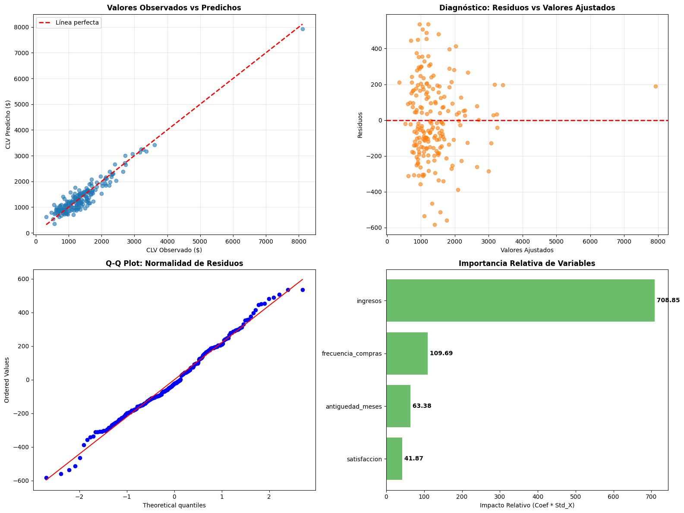
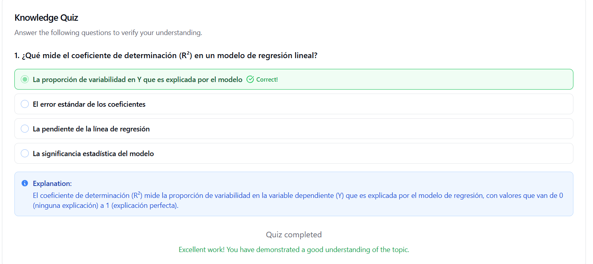

# 📊 Modelado Predictivo de Valor de Vida del Cliente (CLV)
| Autor            | Fecha        | Día |
|------------------|--------------|----------|
| **Carlos Vásquez** |06 Enero 2026 | 4| 

## 🎯 Objetivo del Proyecto

Construir un modelo de regresión lineal para predecir el **Customer Lifetime Value (CLV)** basándose en características del cliente como ingresos, frecuencia de compras, antigüedad y satisfacción.

---

## 📋 Tabla de Contenidos

1. [Requisitos Previos](#requisitos-previos)
2. [Instalación](#instalación)
3. [Estructura del Proyecto](#estructura-del-proyecto)
4. [Ejecución Paso a Paso](#ejecución-paso-a-paso)
5. [Interpretación de Resultados](#interpretación-de-resultados)
6. [Diagnóstico del Modelo](#diagnóstico-del-modelo)
7. [Preguntas Frecuentes](#preguntas-frecuentes)

---

## 🔧 Requisitos Previos

### Software Necesario
- Python 3.8 o superior
- Jupyter Notebook o JupyterLab
- pip (gestor de paquetes de Python)

### Conocimientos Recomendados
- Conceptos básicos de Python
- Fundamentos de estadística descriptiva
- Nociones de regresión lineal

---

## 📦 Instalación

### Paso 1: Crear un entorno virtual (recomendado)

```bash
# En Windows
python -m venv venv
venv\Scripts\activate

# En macOS/Linux
python3 -m venv venv
source venv/bin/activate
```

### Paso 2: Instalar dependencias

```bash
pip install pandas numpy statsmodels scikit-learn matplotlib scipy
```

### Paso 3: Instalar Jupyter Notebook

```bash
pip install jupyter
```

### Paso 4: Verificar instalación

```python
import pandas as pd
import statsmodels.api as sm
import sklearn
print("✅ Todas las bibliotecas instaladas correctamente")
```

---

## 📁 Estructura del Proyecto

```
proyecto-clv/
│
├── clv_analysis.ipynb          # Notebook principal
├── README.md                    # Este archivo
├── requirements.txt             # Dependencias del proyecto
└── visualizacionCompleta.png                      
```

---
## Scripts
[Código](clv_analysis.ipynb)

## Visualizacion Completa


## 🚀 Ejecución Paso a Paso

### **PASO 1: Generación de Datos**

El código genera automáticamente un dataset sintético de 200 clientes con las siguientes variables:

- **edad**: Edad del cliente (18-70 años)
- **ingresos**: Ingresos anuales (distribución log-normal)
- **frecuencia_compras**: Número de compras al año
- **antiguedad_meses**: Meses como cliente
- **satisfaccion**: Nivel de satisfacción (1-10)
- **canal_adquisicion**: Online, Tienda o App
- **clv**: Variable objetivo (calculada con ruido homocedástico)

**¿Qué observar?**
- CLV promedio y rango de valores
- Correlaciones entre variables y CLV

---

### **PASO 2: Construcción de Modelos**

#### **Modelo 1: Regresión Simple**
```
CLV = β₀ + β₁(ingresos) + ε
```

**Objetivo**: Establecer una línea base usando solo ingresos como predictor.

**Métricas clave**:
- **R²**: Proporción de variabilidad explicada
- **RMSE**: Error promedio de predicción en dólares

---

#### **Modelo 2: Regresión Múltiple**
```
CLV = β₀ + β₁(ingresos) + β₂(frecuencia_compras) + β₃(antiguedad_meses) + β₄(satisfaccion) + ε
```

**Objetivo**: Mejorar las predicciones incorporando múltiples factores.

**Comparación**: El modelo múltiple debería mostrar mejoras significativas en R² y RMSE.

---

### **PASO 3: Interpretación de Coeficientes**

Para cada variable, el código muestra:

1. **Coeficiente (β)**: Cambio en CLV por unidad de cambio en X
2. **Intervalo de confianza (95%)**: Rango probable del efecto real
3. **Valor p**: Significancia estadística (p < 0.05 = significativo)
4. **Interpretación práctica**: Traducción a impacto monetario

#### Ejemplo de interpretación:

Si el coeficiente de `frecuencia_compras` es **50.23**:
- "Por cada compra adicional al año, el CLV aumenta en $50.23"
- Si p < 0.05, este efecto es estadísticamente significativo

---

### **PASO 4: Validación de Supuestos**

La regresión lineal asume 4 supuestos fundamentales:

#### ✅ **1. Linealidad**
- Se verifica visualmente en el gráfico "Residuos vs Valores Ajustados"
- **Qué buscar**: Puntos distribuidos aleatoriamente sin patrón

#### ✅ **2. Normalidad de Residuos**
- **Test de Shapiro-Wilk**: p > 0.05 indica normalidad
- **Q-Q Plot**: Puntos deben seguir la línea roja

#### ✅ **3. Homocedasticidad (Varianza constante)**
- **Test de Breusch-Pagan**: p > 0.05 indica varianza constante
- **Gráfico de residuos**: Dispersión uniforme en todos los niveles

#### ✅ **4. Independencia de Residuos**
- **Estadístico Durbin-Watson**: Ideal entre 1.5 y 2.5
- Valores cercanos a 2.0 indican independencia

#### ✅ **5. No Multicolinealidad**
- **VIF (Variance Inflation Factor)**: < 5 es aceptable, < 10 es tolerable
- VIF alto indica que las variables predictoras están correlacionadas entre sí

---

### **PASO 5: Visualización y Diagnóstico**

El código genera 4 gráficos clave:

1. **Observados vs Predichos**: Evalúa precisión general del modelo
2. **Residuos vs Ajustados**: Detecta heterocedasticidad y no linealidad
3. **Q-Q Plot**: Verifica normalidad de residuos
4. **Importancia de Variables**: Muestra el impacto relativo de cada predictor

---

## 📊 Interpretación de Resultados

### Métricas del Modelo

| Métrica | Descripción | Valor Ideal |
|---------|-------------|-------------|
| **R²** | % de variabilidad explicada | > 0.70 (bueno), > 0.85 (excelente) |
| **RMSE** | Error promedio de predicción | Lo más bajo posible en $ |
| **AIC** | Calidad del modelo (penaliza complejidad) | Menor es mejor |

### Interpretación del R²

- **R² = 0.95**: El modelo explica el 95% de la variabilidad en CLV
- **R² ajustado**: Considera el número de predictores (mejor para comparar modelos)

---

## 🔍 Diagnóstico del Modelo

### ⚠️ Problemas Comunes y Soluciones

#### **Problema 1: Heterocedasticidad**
**Síntoma**: Test Breusch-Pagan con p < 0.05

**Impacto**: 
- Los errores estándar son incorrectos
- Los intervalos de confianza no son confiables
- Las pruebas de hipótesis pueden ser engañosas

**Soluciones**:
1. Transformar la variable dependiente (log, raíz cuadrada)
2. Usar errores estándar robustos (HC3, HC4)
3. Modelar la varianza explícitamente (WLS - Weighted Least Squares)

---

#### **Problema 2: No Normalidad de Residuos**
**Síntoma**: Test Shapiro-Wilk con p < 0.05

**Impacto**:
- Los intervalos de confianza pueden ser imprecisos
- Las pruebas t pueden no ser válidas (especialmente en muestras pequeñas)

**Soluciones**:
1. Transformar variables (Box-Cox)
2. Usar bootstrap para intervalos de confianza
3. Con n > 30, el Teorema Central del Límite ayuda (menos crítico)

---

#### **Problema 3: Multicolinealidad Alta**
**Síntoma**: VIF > 10 en alguna variable

**Impacto**:
- Coeficientes inestables
- Intervalos de confianza muy amplios
- Difícil interpretación de efectos individuales

**Soluciones**:
1. Eliminar variables redundantes
2. Combinar variables correlacionadas
3. Usar PCA (análisis de componentes principales)
4. Regularización (Ridge, Lasso)

---

#### **Problema 4: Autocorrelación**
**Síntoma**: Durbin-Watson < 1.5 o > 2.5

**Impacto**:
- Errores estándar sesgados
- Pruebas de hipótesis inválidas

**Soluciones**:
1. Incluir variables temporales relevantes
2. Usar modelos de series temporales (ARIMA)
3. Errores estándar HAC (Heteroskedasticity and Autocorrelation Consistent)

---

## 🎓 Preguntas de Verificación

### **Pregunta 1: Interpretación del Coeficiente de Ingresos**

**Respuesta esperada**:
Si el coeficiente es, por ejemplo, 0.02:
- "Por cada dólar adicional en ingresos anuales, el CLV aumenta en $0.02"
- "Por cada $1,000 adicionales en ingresos, el CLV aumenta en $20"
- Este efecto asume que todas las demás variables permanecen constantes (ceteris paribus)

**Consideraciones**:
- El intervalo de confianza del 95% proporciona el rango probable del efecto real
- El valor p indica si este efecto es estadísticamente significativo
- La significancia práctica (tamaño del efecto) es tan importante como la estadística

---

### **Pregunta 2: Supuestos Violados y su Impacto**

**Análisis por supuesto**:

1. **Si se viola Linealidad**:
   - Las predicciones serán sistemáticamente sesgadas
   - El modelo subestima o sobreestima en diferentes rangos
   - **Solución**: Agregar términos cuadráticos o usar modelos no lineales

2. **Si se viola Homocedasticidad**:
   - Los intervalos de confianza son incorrectos
   - Las pruebas t pueden dar falsos positivos/negativos
   - **Solución**: Usar errores robustos o transformar variables

3. **Si se viola Normalidad**:
   - Los intervalos de confianza pueden ser imprecisos
   - Menos crítico con muestras grandes (n > 30)
   - **Solución**: Transformaciones o métodos no paramétricos

4. **Si hay Multicolinealidad**:
   - Los coeficientes son inestables (varían mucho entre muestras)
   - Las predicciones siguen siendo buenas, pero la interpretación es difícil
   - **Solución**: Eliminar variables redundantes o usar regularización

**Impacto en Confiabilidad**:
- **Predicciones**: Menos afectadas si solo se busca predicción (no interpretación)
- **Inferencia**: Muy afectada (intervalos de confianza, pruebas de hipótesis)
- **Toma de decisiones**: Riesgo de conclusiones incorrectas sobre qué variables importan

---

## 📈 Mejores Prácticas

### Para Mejorar el Modelo:

1. **División Train/Test**: Usar 70-30 o 80-20 para validación
2. **Validación Cruzada**: k-fold CV para estimar rendimiento real
3. **Regularización**: Ridge o Lasso para prevenir sobreajuste
4. **Ingeniería de Características**: Crear interacciones o términos polinomiales
5. **Análisis de Outliers**: Detectar y tratar valores atípicos influyentes

### Para Comunicar Resultados:

1. **Usar gráficos claros**: Los visuales facilitan la comprensión
2. **Contextualizar métricas**: RMSE de $500 puede ser mucho o poco según el CLV promedio
3. **Reportar incertidumbre**: Siempre incluir intervalos de confianza
4. **Validar en nuevos datos**: La prueba real es el rendimiento out-of-sample

---

## 🆘 Solución de Problemas

### Error: "ModuleNotFoundError"
```bash
pip install --upgrade [nombre_del_módulo]
```

### Error: "ValueError: shapes not aligned"
- Verificar que todas las variables estén completas (sin NaN)
- Usar `df.dropna()` si es necesario

### Gráficos no se muestran
```python
%matplotlib inline  # En Jupyter
plt.show()          # En scripts Python
```

---

## 📚 Recursos Adicionales

- [Documentación Statsmodels](https://www.statsmodels.org/)
- [Scikit-learn User Guide](https://scikit-learn.org/stable/user_guide.html)
- [Curso de Regresión Lineal - Coursera](https://www.coursera.org/)
- [Introduction to Statistical Learning](https://www.statlearning.com/) - Libro gratuito

---

## 📝 Notas Finales

Este proyecto es un **ejercicio educativo** con datos sintéticos. En un proyecto real:

- Usa datos históricos reales de clientes
- Valida el modelo en datos futuros (out-of-time validation)
- Considera factores externos (estacionalidad, economía, competencia)
- Actualiza el modelo periódicamente
- Incorpora feedback del negocio sobre la utilidad de las predicciones

## Test final educativo
